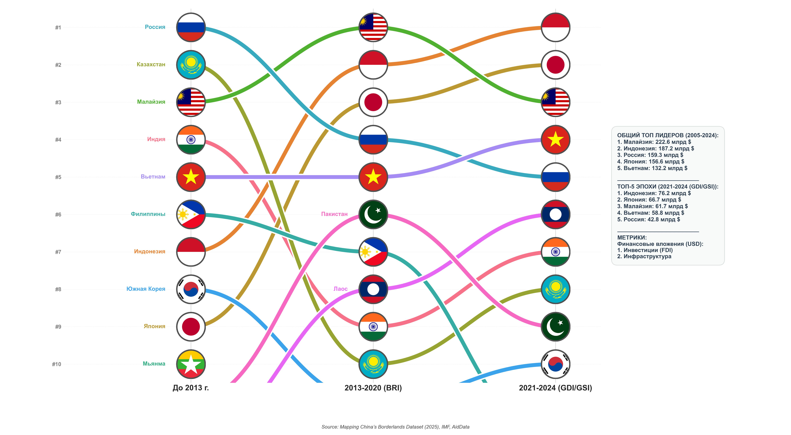
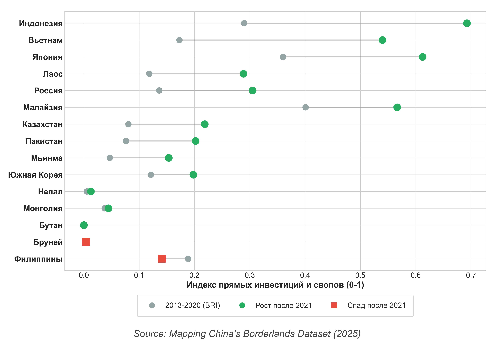
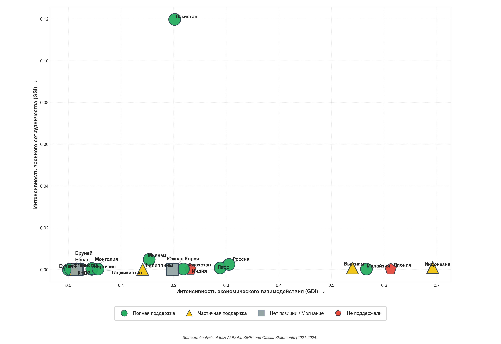
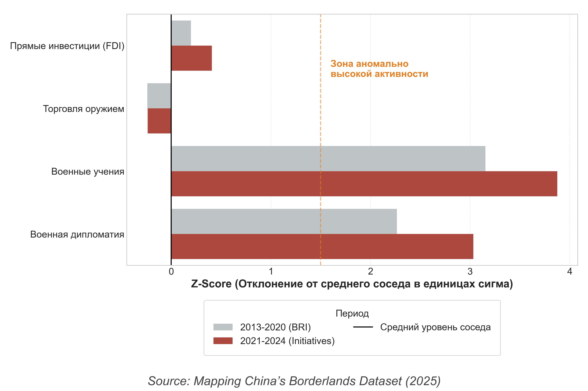
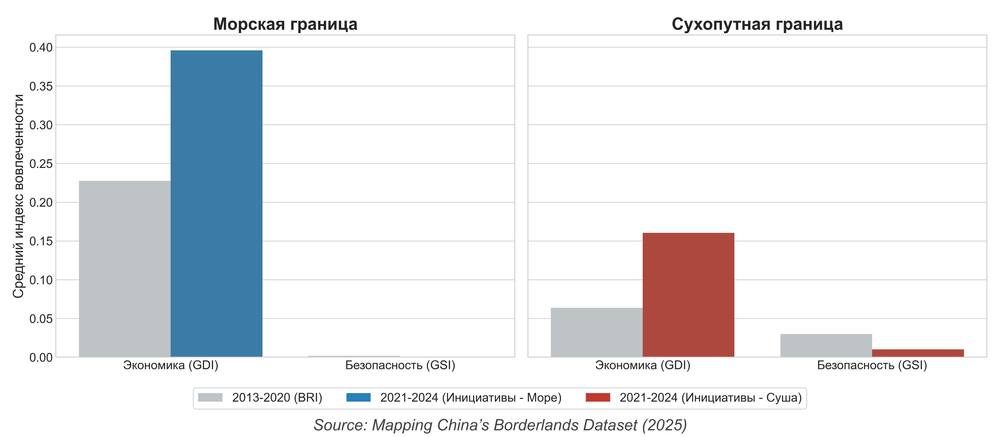
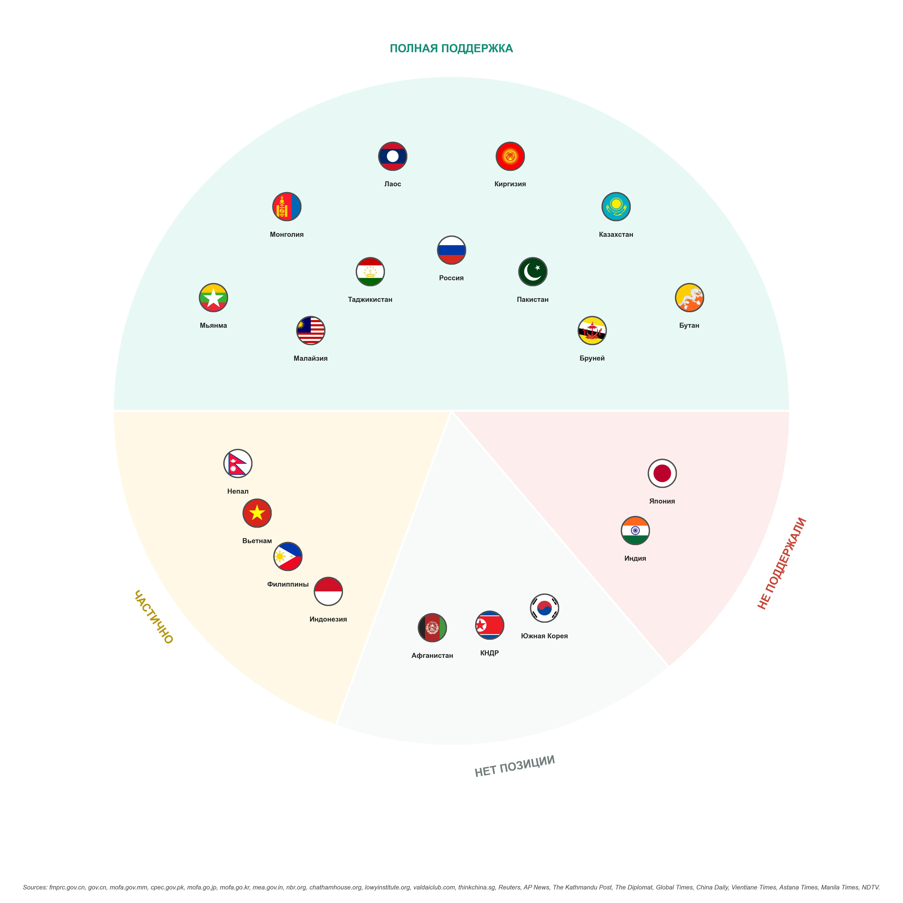

# 📊 Внешняя политика КНР в приграничных регионах (2005–2024): Визуализация данных


[](https://opensource.org/licenses/MIT)

Данный репозиторий содержит исходный код на Python для генерации аналитических графиков и диаграмм, использованных в дипломной работе. Цель репозитория — обеспечить **полную прозрачность, достоверность и воспроизводимость** результатов исследования. 

Скрипты анализируют инструменты экономического (GDI), связанного с безопасностью (GSI) и гуманитарного (GCI) влияния Китая на 20 соседних государств (сухопутные и морские границы).

## 🗂 Источники данных

Основной массив данных опирается на **Mapping China’s Borderlands Dataset (2025)** (china_data.csv), который агрегирует статистику из следующих баз:
* **Экономика:** IMF, AidData (FDI, Infrastructure, SEZ)
* **Безопасность:** SIPRI (Arms Transfers TIV), NDU (Military diplomacy & joint exercises)
* **Гуманитарное влияние:** AidData, NBR (Healthcare, Confucius Institutes, Judicial engagements)

## 📈 Основные визуализации и результаты работы алгоритмов

Код разделен на модули по типу анализа. При запуске скриптов генерируются изображения, готовые к вставке в научную работу. Ниже представлены примеры работы кода.

### 1. Динамика лидерства (Bump Charts)
Отображает изменение топ-лидеров по объему получаемой от КНР поддержки на разных исторических этапах.
*Скрипты: `bump_charts.py`, `Rank_Humanitarian.py`*

<p align="center">
  
</p>

### 2. Сдвиг парадигмы (Dumbbell Charts)
Сравнение эпохи инициативы «Один пояс, один путь» (2013–2020) и эпохи Глобальных Инициатив Си Цзиньпина (2021+). Рост показателей отмечен **зелеными кругами**, спад — **красными квадратами**.
*Скрипты: `Impact_Dumbbell.py`, `Security_Dumbbell.py`, `Humanitarian_Dumbbell.py`*

<p align="center">
  
</p>

### 3. Кластерный анализ (K-Means)
Распределение стран по уровню экономического и военного вовлечения с учетом их официальной дипломатической позиции (форма маркера отражает реакцию страны на инициативы Пекина).
*Скрипты: `Clusters.py`, `Clusters_Positions_Shapes.py`*

<p align="center">
  
</p>

### 4. Аномалия России (Z-Score)
Оценка уникальности положения России по сравнению со «средним» соседом КНР (отклонение в единицах сигма).
*Скрипт: `Russia_Anomaly.py`*

<p align="center">
  
</p>

### 5. Структурный и географический анализ
Сравнение стратегий КНР на сухопутных и морских границах, а также консенсус пограничных стран по Глобальным Инициативам КНР.
*Скрипты: `Land_vs_Sea.py`, `Initiative_Groups.py`, `Initiative_Performance.py`*

<p align="center">
  
  
</p>

## 🛠 Структура репозитория

```text
📦 diplom_china
 ┣ 📂 flags/                     # Иконки флагов стран для графиков (.jpg)
 ┣ 📂 img/                       # Сгенерированные графики для README
 ┣ 📜 china_data.csv             # Исходный набор данных
 ┣ 📜 china_config.py            # Общие настройки, цветовые палитры и загрузчик данных
 ┣ 📜 charts_bump.py             # Скрипт визуализации (экономика, оружие)
 ┣ 📜 Impact_Dumbbell.py         # Скрипт визуализации (сдвиг парадигмы)
 ┣ ...                           # Остальные скрипты генерации графиков
 ┗ 📜 README.md                  # Описание проекта
```

## 🚀 Инструкция по запуску (Воспроизведение графиков)

Любой желающий может запустить код локально, чтобы проверить достоверность расчетов и графиков.

### 1. Подготовка окружения
Убедитесь, что у вас установлен Python (версии 3.8 или выше). Затем установите необходимые зависимости:

```bash
pip install -r requirements.txt
```

### 2. Клонирование репозитория
```bash
git clone https://github.com/defl-orator/diplom_china.git
cd diplom_china
```

### 3. Запуск скриптов
Запустите любой из интересующих вас скриптов. Например, для генерации графика изменения экономического влияния:

```bash
python Impact_Dumbbell.py
```

После выполнения скрипта в корневой папке появится актуальный файл (например, `Impact_Dumbbell.jpg`), построенный на основе текущих данных `china_data.csv`.

## 🔬 Проверка достоверности (Для проверяющих)

* **Алгоритмы**: Вся логика расчета индексов (нормализация `MinMaxScaler`), агрегации по периодам и кластеризации (`KMeans`) открыта и находится внутри соответствующих скриптов.
* **Отсутствие хардкода**: Графики строятся динамически на основе данных из `china_data.csv`. Изменение данных в таблице автоматически отразится на графиках.
* **Аннотации**: Данные на графиках с «гантелями» и гистограммах автоматически вычисляют процентное изменение между периодами.

---

**Автор:** Николай Масалкин  
**Исследование:** «ВЗАИМОДЕЙСТВИЕ КНР С ПОГРАНИЧНЫМИ СТРАНАМИ: СРАВНИТЕЛЬНОЕ ИССЛЕДОВАНИЕ В РАМКАХ ГЛОБАЛЬНЫХ ИНИЦИАТИВ КИТАЯ»  
**Год:** 2026
