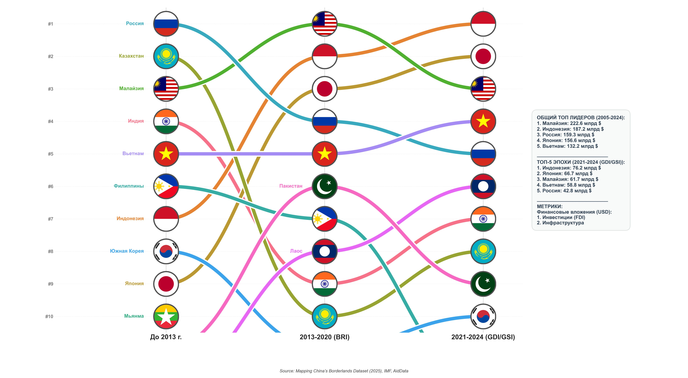
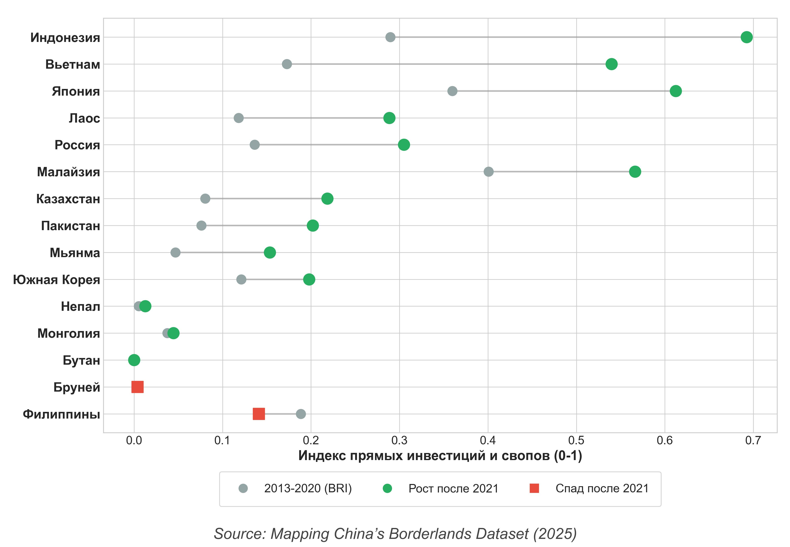
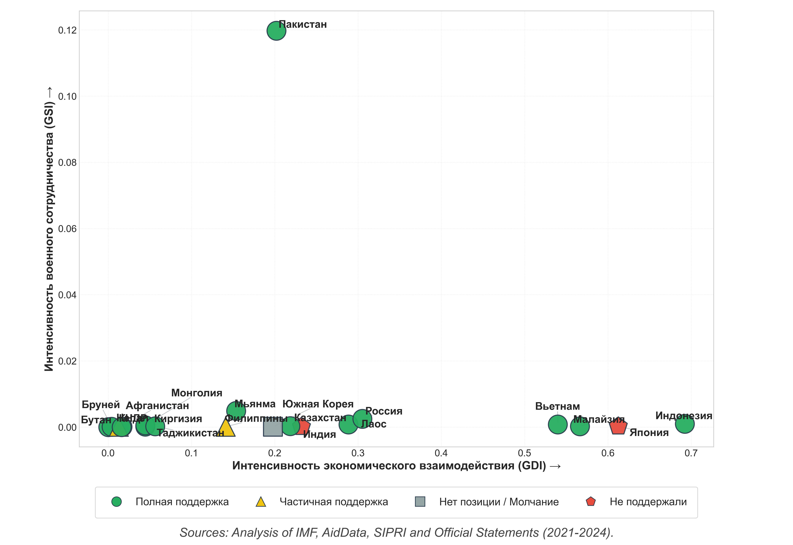
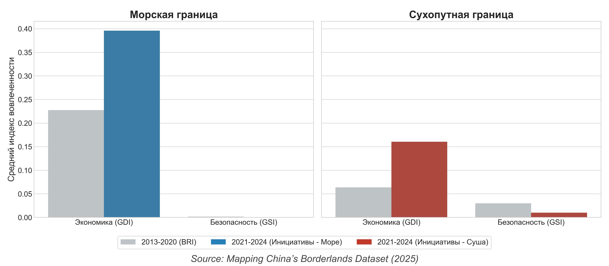
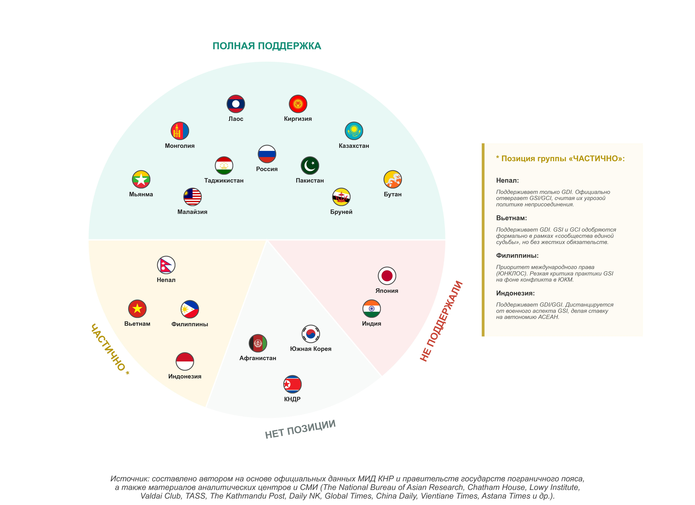

# 📊 China's Foreign Policy in Borderlands (2005–2024): Data Visualization and Analysis


[](https://opensource.org/licenses/MIT)

**🇷🇺 [Russian Version](#russian-version)** | **🇬🇧 [English Version](#english-version)**

---

<a id="english-version"></a>

## 🇬🇧 English Version

### 📊 China's Foreign Policy in Borderlands (2005–2024)

This repository contains the Python source code for generating analytical charts and diagrams used in the bachelor's thesis titled:

**"Interaction of the People's Republic of China with Border Countries: A Comparative Study within the Framework of China's Global Initiatives"**.

The main goal of this repository is to ensure **full transparency, reliability, and reproducibility** of the research results.

The scripts analyze the tools of China's economic (Global Development Initiative — GDI), security-related (Global Security Initiative — GSI), and humanitarian/civilizational (Global Civilization Initiative — GCI) influence on **20 neighboring countries** (14 countries with land borders and 6 key maritime neighbors).

## 🗂 Data Sources

The primary dataset is based on the **Mapping China’s Borderlands Dataset (version 1.0, 2025)** (`china_data.csv`). This dataset aggregates official and processed statistics from the following sources:

- **Economy**: International Monetary Fund (IMF), AidData (Foreign Direct Investment, infrastructure projects, Special Economic Zones)
- **Security**: Stockholm International Peace Research Institute (SIPRI — Arms Transfers Trend Indicator Value), National Defense University (NDU — military diplomacy and joint exercises)
- **Humanitarian and Normative Influence**: AidData, National Bureau of Asian Research (NBR — healthcare, Confucius Institutes, judicial diplomacy and exchanges)

## 📈 Main Visualizations and Analysis Results

The code is divided into modules according to the type of analysis. Running the scripts generates ready-to-use images for insertion into academic work.

### 1. Leadership Dynamics (Bump Charts)
Shows changes in the ranking of top recipient countries of Chinese support across different historical periods.

*Scripts: `bump_charts.py`, `Rank_Humanitarian.py`*

<p align="center">
  
</p>

### 2. Paradigm Shift (Dumbbell Charts)
Compares the era of the "Belt and Road Initiative" (2013–2020) with the era of Global Initiatives (2021 onwards). Green circles indicate growth, red squares indicate decline.

*Scripts: `Impact_Dumbbell.py`, `Security_Dumbbell.py`, `Humanitarian_Dumbbell.py`*

<p align="center">
  
</p>

### 3. Cluster Analysis (K-Means)
Distribution of countries according to their level of economic and military engagement, taking into account their official diplomatic position toward Beijing’s initiatives (marker shape reflects the country’s reaction).

*Scripts: `Clusters.py`, `Clusters_Positions_Shapes.py`*

<p align="center">
  
</p>

### 4. Russia's Statistical Anomaly (Z-Score)
Assessment of the uniqueness of Russia's position compared to the "average" neighbor of China (measured in standard deviations).

*Script: `Russia_Anomaly.py`*

<p align="center">
  
</p>

### 5. Structural and Geographical Analysis
Comparison of China’s strategies on land and maritime borders, as well as the level of consensus among border countries regarding China’s Global Initiatives.

*Scripts: `Land_vs_Sea.py`, `Initiative_Groups.py`, `Initiative_Performance.py`*

<p align="center">
  
  
</p>

## 🛠 Repository Structure

```text
📦 diplom_china
 ┣ 📂 flags/                 # Country flag icons for charts (.jpg)
 ┣ 📂 img/                   # Generated charts for README
 ┣ 📜 china_data.csv         # Main dataset
 ┣ 📜 china_config.py        # Common settings, color palettes and data loader
 ┣ 📜 charts_bump.py         # Bump charts visualization
 ┣ 📜 Impact_Dumbbell.py     # Dumbbell charts
 ┣ 📜 Clusters.py            # K-Means clustering
 ┣ 📜 Russia_Anomaly.py      # Z-score analysis for Russia
 ┣ ...                       # Other visualization scripts
 ┗ 📜 README.md
🚀 How to Reproduce the Results
Anyone can run the code locally to verify the calculations and charts.
1. Prepare the Environment
Make sure you have Python 3.8 or higher installed. Then install the required packages:
Bashpip install -r requirements.txt
2. Clone the Repository
Bashgit clone https://github.com/defl-orator/diplom_china.git
cd diplom_china
3. Run the Scripts
For example, to generate the economic influence paradigm shift chart:
Bashpython Impact_Dumbbell.py
After execution, the corresponding image file (e.g., Impact_Dumbbell.jpg) will appear in the root folder.
🔬 Reproducibility and Verification

All calculation logic (MinMaxScaler normalization, period aggregation, KMeans clustering) is open and located inside the scripts.
There is no hardcoding — all charts are generated dynamically from china_data.csv.
Any changes in the source data will be automatically reflected in the generated visualizations.


Author: Nikolay Masalkin
Thesis: "Interaction of the PRC with Border Countries: A Comparative Study within the Framework of China's Global Initiatives"
Year: 2026

---

<a id="russian-version"></a>

## 🇷🇺 Русская версия

# 📊 Внешняя политика КНР в приграничных регионах (2005–2024): Визуализация данных


[](https://opensource.org/licenses/MIT)

Данный репозиторий содержит исходный код на Python для генерации аналитических графиков и диаграмм, использованных в дипломной работе. Цель репозитория — обеспечить **полную прозрачность, достоверность и воспроизводимость** результатов исследования. 

Скрипты анализируют инструменты экономического (GDI), связанного с безопасностью (GSI) и гуманитарного (GCI) влияния Китая на 20 соседних государств (сухопутные и морские границы).

## 🗂 Источники данных

Основной массив данных опирается на **Mapping China’s Borderlands Dataset (2025)** (china_data.csv), который агрегирует статистику из следующих баз:
* **Экономика:** IMF, AidData (FDI, Infrastructure, SEZ)
* **Безопасность:** SIPRI (Arms Transfers TIV), NDU (Military diplomacy & joint exercises)
* **Гуманитарное влияние:** AidData, NBR (Healthcare, Confucius Institutes, Judicial engagements)

## 📈 Основные визуализации и результаты работы алгоритмов

Код разделен на модули по типу анализа. При запуске скриптов генерируются изображения, готовые к вставке в научную работу. Ниже представлены примеры работы кода.

### 1. Динамика лидерства (Bump Charts)
Отображает изменение топ-лидеров по объему получаемой от КНР поддержки на разных исторических этапах.
*Скрипты: `bump_charts.py`, `Rank_Humanitarian.py`*

<p align="center">
  
</p>

### 2. Сдвиг парадигмы (Dumbbell Charts)
Сравнение эпохи инициативы «Один пояс, один путь» (2013–2020) и эпохи Глобальных Инициатив Си Цзиньпина (2021+). Рост показателей отмечен **зелеными кругами**, спад — **красными квадратами**.
*Скрипты: `Impact_Dumbbell.py`, `Security_Dumbbell.py`, `Humanitarian_Dumbbell.py`*

<p align="center">
  
</p>

### 3. Кластерный анализ (K-Means)
Распределение стран по уровню экономического и военного вовлечения с учетом их официальной дипломатической позиции (форма маркера отражает реакцию страны на инициативы Пекина).
*Скрипты: `Clusters.py`, `Clusters_Positions_Shapes.py`*

<p align="center">
  
</p>

### 4. Аномалия России (Z-Score)
Оценка уникальности положения России по сравнению со «средним» соседом КНР (отклонение в единицах сигма).
*Скрипт: `Russia_Anomaly.py`*

<p align="center">
  
</p>

### 5. Структурный и географический анализ
Сравнение стратегий КНР на сухопутных и морских границах, а также консенсус пограничных стран по Глобальным Инициативам КНР.
*Скрипты: `Land_vs_Sea.py`, `Initiative_Groups.py`, `Initiative_Performance.py`*

<p align="center">
  
  
</p>

## 🛠 Структура репозитория

```text
📦 diplom_china
 ┣ 📂 flags/                     # Иконки флагов стран для графиков (.jpg)
 ┣ 📂 img/                       # Сгенерированные графики для README
 ┣ 📜 china_data.csv             # Исходный набор данных
 ┣ 📜 china_config.py            # Общие настройки, цветовые палитры и загрузчик данных
 ┣ 📜 charts_bump.py             # Скрипт визуализации (экономика, оружие)
 ┣ 📜 Impact_Dumbbell.py         # Скрипт визуализации (сдвиг парадигмы)
 ┣ ...                           # Остальные скрипты генерации графиков
 ┗ 📜 README.md                  # Описание проекта
```

## 🚀 Инструкция по запуску (Воспроизведение графиков)

Любой желающий может запустить код локально, чтобы проверить достоверность расчетов и графиков.

### 1. Подготовка окружения
Убедитесь, что у вас установлен Python (версии 3.8 или выше). Затем установите необходимые зависимости:

```bash
pip install -r requirements.txt
```

### 2. Клонирование репозитория
```bash
git clone https://github.com/defl-orator/diplom_china.git
cd diplom_china
```

### 3. Запуск скриптов
Запустите любой из интересующих вас скриптов. Например, для генерации графика изменения экономического влияния:

```bash
python Impact_Dumbbell.py
```

После выполнения скрипта в корневой папке появится актуальный файл (например, `Impact_Dumbbell.jpg`), построенный на основе текущих данных `china_data.csv`.

## 🔬 Проверка достоверности (Для проверяющих)

* **Алгоритмы**: Вся логика расчета индексов (нормализация `MinMaxScaler`), агрегации по периодам и кластеризации (`KMeans`) открыта и находится внутри соответствующих скриптов.
* **Отсутствие хардкода**: Графики строятся динамически на основе данных из `china_data.csv`. Изменение данных в таблице автоматически отразится на графиках.
* **Аннотации**: Данные на графиках с «гантелями» и гистограммах автоматически вычисляют процентное изменение между периодами.

---

**Автор:** Николай Масалкин  
**Исследование:** «ВЗАИМОДЕЙСТВИЕ КНР С ПОГРАНИЧНЫМИ СТРАНАМИ: СРАВНИТЕЛЬНОЕ ИССЛЕДОВАНИЕ В РАМКАХ ГЛОБАЛЬНЫХ ИНИЦИАТИВ КИТАЯ»  
**Год:** 2026
