# 📊 China's Foreign Policy in Borderlands (2005–2024): Data Visualization and Analysis


[](https://opensource.org/licenses/MIT)

**🇷🇺 [Russian Version](#russian-version)** | **🇬🇧 [English Version](#english-version)**

---

<a id="english-version"></a>

## 🇬🇧 English Version

### 📊 China's Foreign Policy in Borderlands (2005–2024)

This repository contains the Python source code for generating analytical charts and diagrams used in the bachelor's thesis titled:

**"Interaction of the People's Republic of China with Border Countries: A Comparative Study within the Framework of China's Global Initiatives"**.

The main goal of this repository is to ensure **full transparency, reliability, and reproducibility** of the research results.

The scripts analyze the tools of China's economic (Global Development Initiative — GDI), security-related (Global Security Initiative — GSI), and humanitarian/civilizational (Global Civilization Initiative — GCI) influence on **20 neighboring countries** (14 countries with land borders and 6 key maritime neighbors).

## 🗂 Data Sources

The primary dataset is based on the **Mapping China’s Borderlands Dataset (version 1.0, 2025)** (`china_data.csv`). This dataset aggregates official and processed statistics from the following sources:

- **Economy**: International Monetary Fund (IMF), AidData (Foreign Direct Investment, infrastructure projects, Special Economic Zones)
- **Security**: Stockholm International Pace Research Institute (SIPRI — Arms Transfers Trend Indicator Value), National Defense University (NDU — military diplomacy and joint exercises)
- **Humanitarian and Normative Influence**: AidData, National Bureau of Asian Research (NBR — healthcare, Confucius Institutes, judicial diplomacy and exchanges)

## 📈 Main Visualizations and Analysis Results

The codebase is divided into targeted analysis modules. Running the generation pipeline produces high-resolution vector and raster charts structured cleanly by language settings.

### 1. Leadership Dynamics (Bump Charts)
Shows changes in the ranking of top recipient countries of Chinese support across different historical periods.

*Scripts: `Rank_Invest_and_Rank_Arms.py`, `Rank_Humanitarian.py`*

<p align="center">
  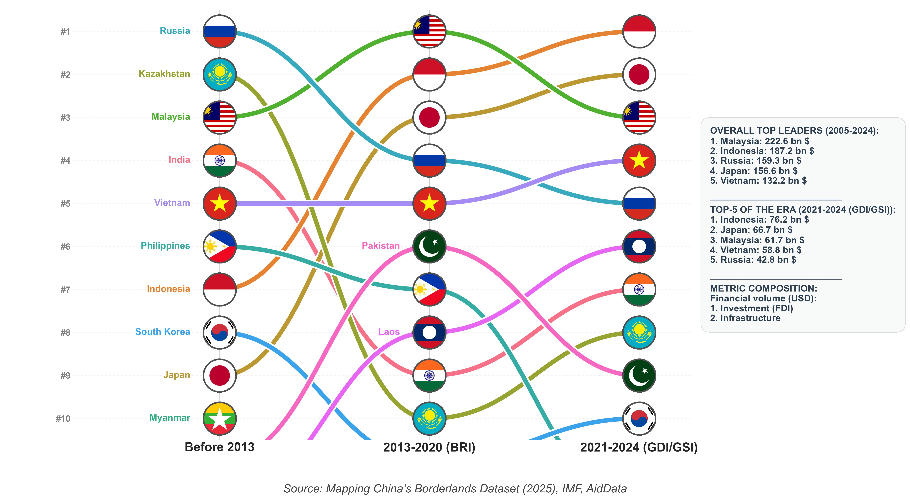
</p>

### 2. Paradigm Shift (Dumbbell Charts)
Compares the era of the "Belt and Road Initiative" (2013–2020) with the era of Global Initiatives (2021 onwards). Green markers indicate growth, red markers indicate decline.

*Scripts: `Impact_Dumbbell.py`, `Security_Dumbbell.py`, `Humanitarian_Dumbbell.py`*

<p align="center">
  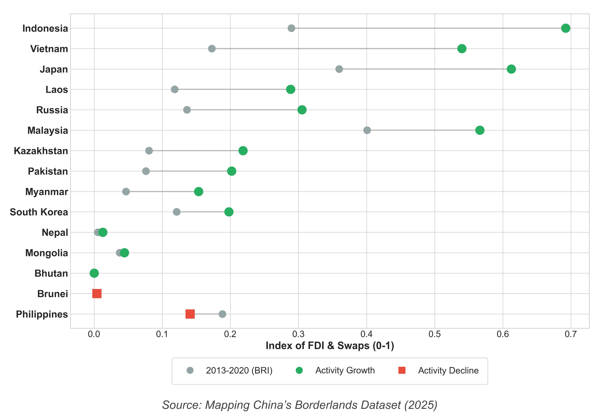
</p>

### 3. Cluster Analysis
Distribution of countries according to their level of economic and military engagement, taking into account their official diplomatic position toward Beijing’s initiatives (marker shape reflects the country’s alignment reaction).

*Scripts: `Clusters.py`, `Clusters_Positions_Shapes.py`*

<p align="center">
  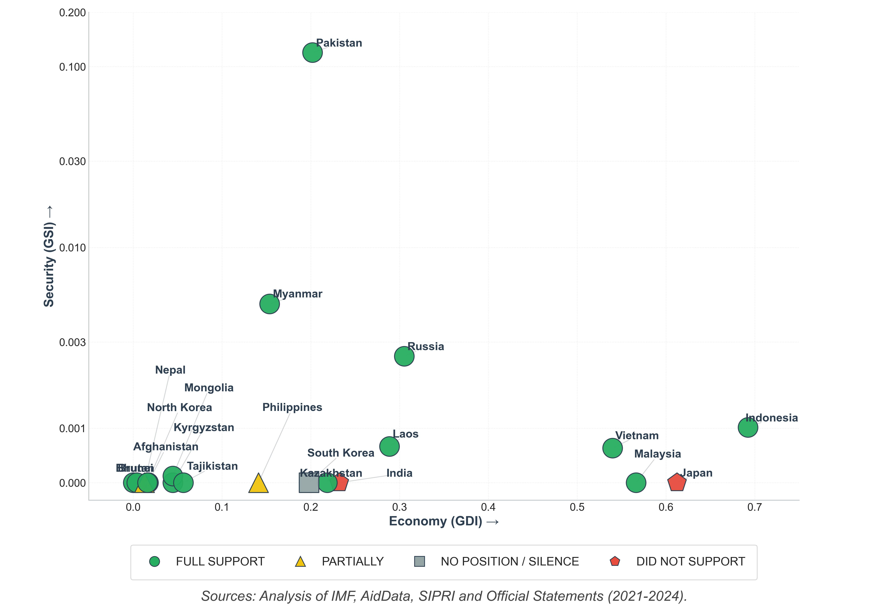
</p>

### 4. Russia's Statistical Anomaly (Z-Score)
Assessment of the uniqueness of Russia's position compared to the "average" neighbor of China (measured in standard deviations to evaluate relative divergence trends).

*Script: `Russia_Anomaly_Comp.py`*

<p align="center">
  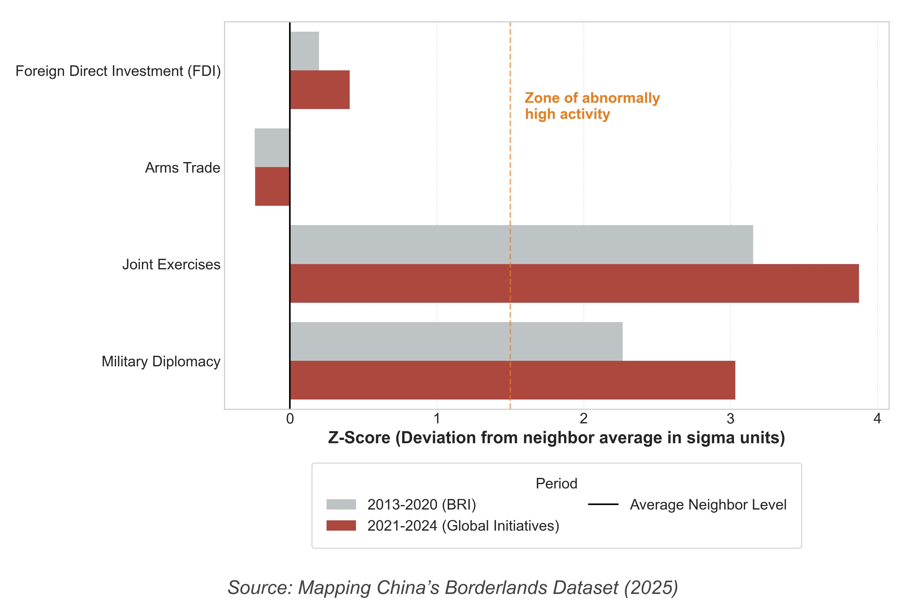
</p>

### 5. Structural and Geographical Analysis
Comparison of China’s strategies on land and maritime borders, as well as the level of political consensus among border countries regarding China’s Global Initiatives.

*Scripts: `Land_vs_Sea_Comp.py`, `Initiative_Consensus.py`, `Initiative_Performance.py`*

<p align="center">
  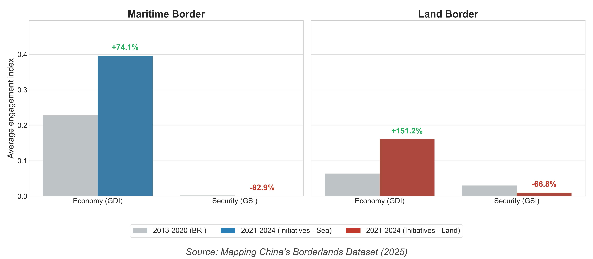
  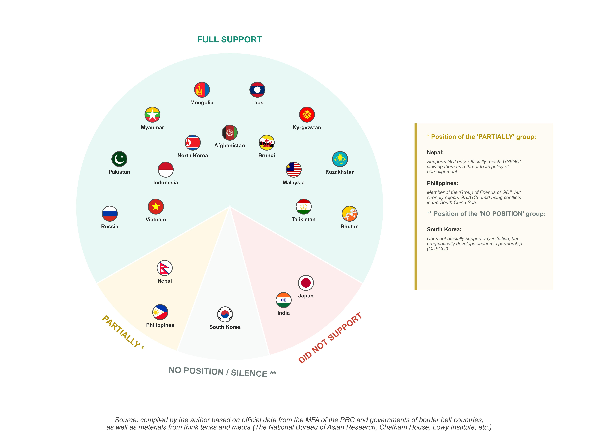
</p>

## 🛠 Repository Structure

```text
📦 diplom_china
 ┣ 📂 flags/                     # Country flag icons for circular layouts (.jpg)
 ┣ 📂 img/                       # Charts for display in README (with _EN/_RU suffixes)
 ┣ 📂 charts_results_en/         # Automatically generated English charts
 ┣ 📂 charts_results_ru/         # Automatically generated Russian charts
 ┣ 📜 china_data.csv             # Primary dataset
 ┣ 📜 china_config.py            # Global configuration, translations, and automated save routing
 ┣ 📜 run_all.py                 # Master pipeline execution script
 ┣ 📜 Russia_Pivot.py            # Localized Russia development pivot chart
 ┣ 📜 Russia_Anomaly_Comp.py     # Russia's relative comparative anomaly Z-score chart
 ┣ 📜 Security_Dumbbell.py       # Security paradigm shift dumbbell chart
 ┣ 📜 Initiative_Consensus.py    # Group support circular consensus chart
 ┣ ...                           # Other individual chart scripts
 ┗ 📜 README.md                  # This documentation
```

## 🚀 How to Reproduce All Results

The entire visualization pipeline is designed for fully automated reproduction.

### 1. Prepare the Environment
Make sure you have Python 3.8 or higher installed. Then install the required dependencies:
```bash
pip install -r requirements.txt
```

### 2. Configure Your Language Settings
Open `china_config.py` in any text editor and edit the `LANG` global variable at the top of the file:
* Set `LANG = 'EN'` for English.
* Set `LANG = 'RU'` for Russian.

### 3. Generate All Charts with One Command
Execute the master runner pipeline script:
```bash
python run_all.py
```
This script automatically:
1. Switches Python's working directory to the location of the scripts [2].
2. Generates all 14 active analytical charts sequentially.
3. Automatically routes all files into a structured localized folder (`charts_results_en/` or `charts_results_ru/` with correct language suffixes).

## 🔬 Scientific Transparency and Verification

- **Statistical Robustness**: All data preprocessing layers (e.g., standard MinMaxScaler normalization, z-score statistical scaling, clustering parameters) are dynamically calculated inside the open-source scripts directly from the source `china_data.csv`.
- **Zero Hardcoding**: All legends, axis tick margins, and percentages of change are automatically calculated and plotted. Any modifications in `china_data.csv` will immediately and correctly rebuild all relevant charts.

---

**Author:** Nikolay Masalkin  
**Thesis:** "Interaction of the People's Republic of China with Border Countries: A Comparative Study within the Framework of China's Global Initiatives"  
**Year:** 2026

---

<a id="russian-version"></a>

## 🇷🇺 Русская версия

# 📊 Внешняя политика КНР в приграничных регионах (2005–2024): Визуализация данных


[](https://opensource.org/licenses/MIT)

Данный репозиторий содержит исходный код на Python для генерации аналитических графиков и диаграмм, использованных в бакалаврской дипломной работе на тему:

**«Взаимодействие КНР с пограничными странами: сравнительное исследование в рамках Глобальных инициатив Китая»**.

Основная цель репозитория — обеспечить **полную прозрачность, достоверность и воспроизводимость** результатов академического исследования.

Скрипты анализируют инструменты экономического (Global Development Initiative — GDI), оборонного (Global Security Initiative — GSI) и гуманитарного/цивилизационного (Global Civilization Initiative — GCI) влияния Китая на **20 соседних государства** (14 сухопутных соседей и 6 ключевых морских партнеров).

## 🗂 Источники данных

Основной массив данных опирается на базу **Mapping China’s Borderlands Dataset (версия 1.0, 2025)** (`china_data.csv`), объединяющую проверенную статистику из следующих мировых источников:
- **Экономика**: IMF, AidData (объемы прямых инвестиций, инфраструктурных проектов, запуск особых экономических зон)
- **Безопасность**: SIPRI (Arms Transfers Trend Indicator Value — импорт вооружений), National Defense University (NDU — частота военных учений и визитов военной дипломатии)
- **Гуманитарное влияние**: AidData, National Bureau of Asian Research (NBR — медицинские проекты, институты Конфуция, судебная дипломатия)

## 📈 Основные визуализации и результаты работы алгоритмов

Программный код разделен на узкоспециализированные аналитические модули. При запуске пайплайна генерируются изображения высокого разрешения, отсортированные по выбранным языковым настройкам.

### 1. Динамика лидерства (Bump Charts)
Отображает изменение топ-лидеров по объему получаемой от КНР поддержки на разных исторических этапах.

*Скрипты: `Rank_Invest_and_Rank_Arms.py`, `Rank_Humanitarian.py`*

<p align="center">
  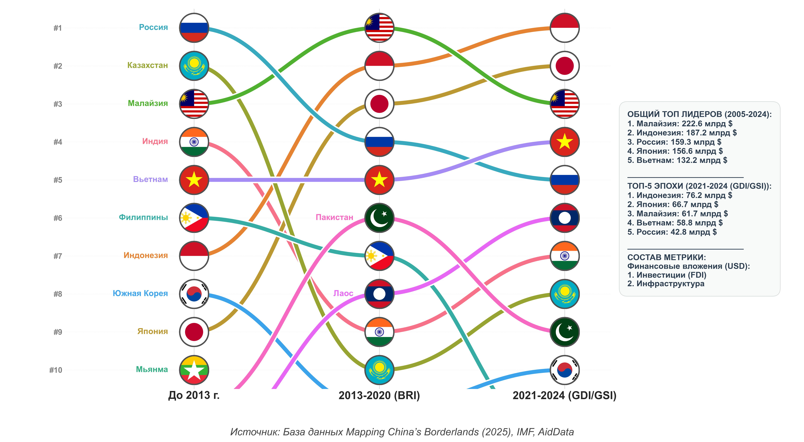
</p>

### 2. Сдвиг парадигмы (Dumbbell Charts)
Сравнение эпохи инициативы «Один пояс, один путь» (2013–2020) и эпохи Глобальных Инициатив Си Цзиньпина (2021+). Рост показателей отмечен **зелеными кругами**, спад — **красными квадратами**.

*Скрипты: `Impact_Dumbbell.py`, `Security_Dumbbell.py`, `Humanitarian_Dumbbell.py`*

<p align="center">
  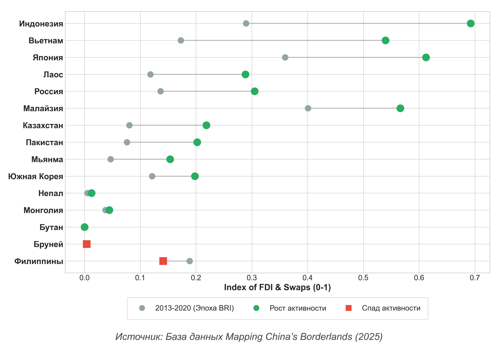
</p>

### 3. Кластерный анализ
Распределение стран по уровню экономического и военного вовлечения с учетом их официальной дипломатической позиции (форма маркера отражает реакцию страны на инициативы Пекина).

*Скрипты: `Clusters.py`, `Clusters_Positions_Shapes.py`*

<p align="center">
  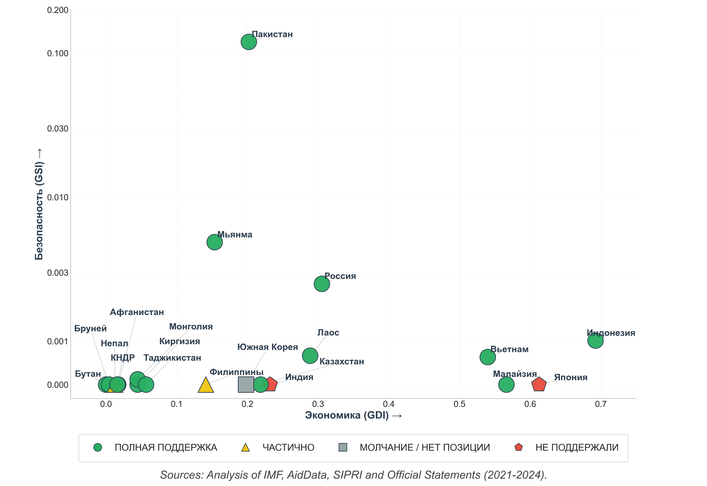
</p>

### 4. Аномалия России (Z-Score)
Оценка уникальности положения России по сравнению со «средним» соседом КНР (отклонение в единицах сигма для выявления относительных расхождений в динамике).

*Скрипт: `Russia_Anomaly_Comp.py`*

<p align="center">
  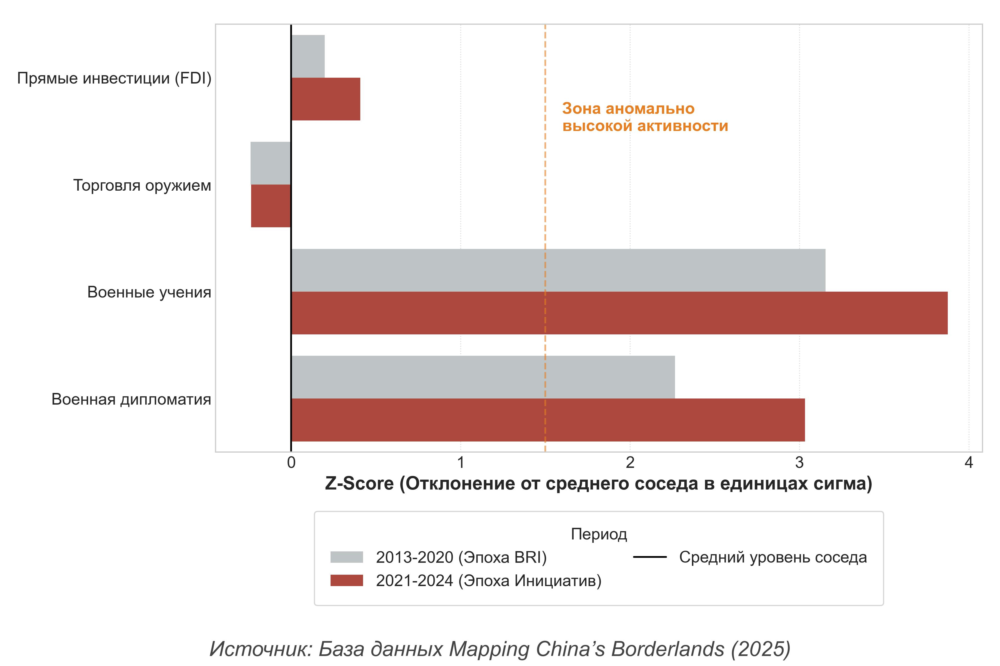
</p>

### 5. Структурный и географический анализ
Сравнение стратегий КНР на сухопутных и морских границах, а также политический консенсус приграничных стран по Глобальным Инициативам КНР.

*Скрипты: `Land_vs_Sea_Comp.py`, `Initiative_Consensus.py`, `Initiative_Performance.py`*

<p align="center">
  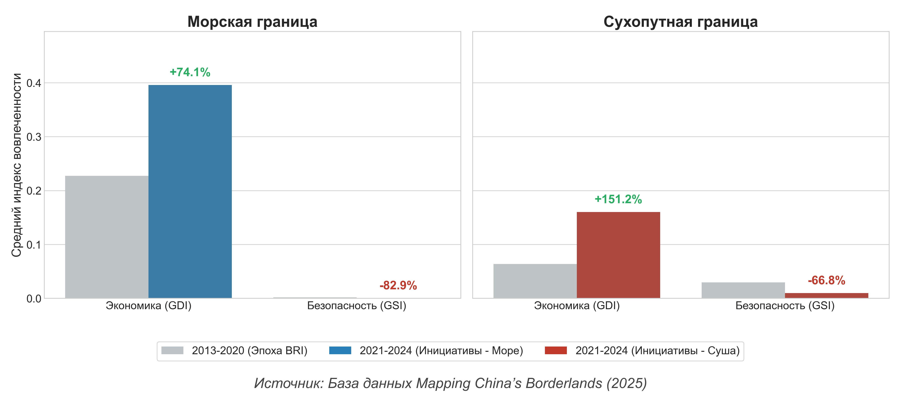
  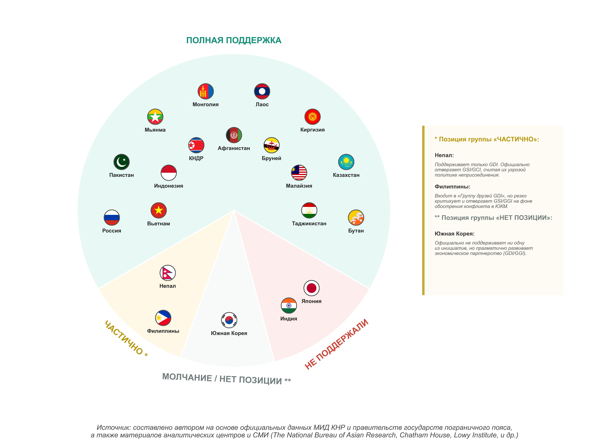
</p>

## 🛠 Структура репозитория

```text
📦 diplom_china
 ┣ 📂 flags/                     # Иконки флагов стран для круговых макетов (.jpg)
 ┣ 📂 img/                       # Сгенерированные графики для README (с суффиксами _EN/_RU)
 ┣ 📂 charts_results_en/         # Автоматически генерируемые графики на английском языке
 ┣ 📂 charts_results_ru/         # Автоматически генерируемые графики на русском языке
 ┣ 📜 china_data.csv             # Исходный набор данных
 ┣ 📜 china_config.py            # Настройки, переводы и перехватчик путей сохранения
 ┣ 📜 run_all.py                 # Мастер-скрипт пакетного запуска
 ┣ 📜 Russia_Pivot.py            # Скрипт визуализации (трансформация позиций РФ)
 ┣ 📜 Russia_Anomaly_Comp.py     # Скрипт расчета Z-Score аномальности РФ
 ┣ 📜 Security_Dumbbell.py       # Скрипт сравнения оборонных контактов КНР
 ┣ 📜 Initiative_Consensus.py    # Скрипт визуализации групп дипломатической поддержки
 ┣ ...                           # Остальные скрипты генерации графиков
 ┗ 📜 README.md                  # Данная документация
```

## 🚀 Инструкция по пакетному запуску (Воспроизведение)

Процесс воссоздания всех аналитических графиков полностью автоматизирован.

### 1. Подготовка окружения
Убедитесь, что у вас установлен Python (версии 3.8 или выше). Затем установите необходимые зависимости:
```bash
pip install -r requirements.txt
```

### 2. Выбор целевого языка
Откройте файл `china_config.py` в любом текстовом редакторе и измените переменную `LANG` в самом начале файла:
* Задайте `LANG = 'RU'` для вывода графиков на русском языке.
* Задайте `LANG = 'EN'` для вывода графиков на английском языке.

### 3. Генерация всех графиков одной командой
Запустите мастер-скрипт автоматической сборки:
```bash
python run_all.py
```
Этот скрипт самостоятельно:
1. Переключит рабочую директорию процесса на папку со скриптами [2].
2. Последовательно выполнит расчеты и визуализацию всех 14 активных графиков.
3. Отсортирует полученные файлы в нужную языковую папку (`charts_results_en/` или `charts_results_ru/`) с соответствующими суффиксами языков.

## 🔬 Проверка достоверности расчетов (Для рецензентов)

- **Статистическая строгость**: Вся математическая логика (нормализация `MinMaxScaler`, расчет средних по периодам, вычисление отклонений `z-score` и кластеризация `KMeans`) выполняется прозрачно прямо внутри скриптов на основе данных `china_data.csv`.
- **Отсутствие статического хардкода**: Координаты, усы погрешностей, лимиты шкал и расчет процентов изменений вычисляются динамически. Любые точечные изменения в таблице `china_data.csv` автоматически перестроят графики без искажения структуры [13].

---

**Автор:** Николай Масалкин  
**Исследование:** «Взаимодействие КНР с пограничными странами: сравнительное исследование в рамках Глобальных инициатив Китая»  
**Год:** 2026
